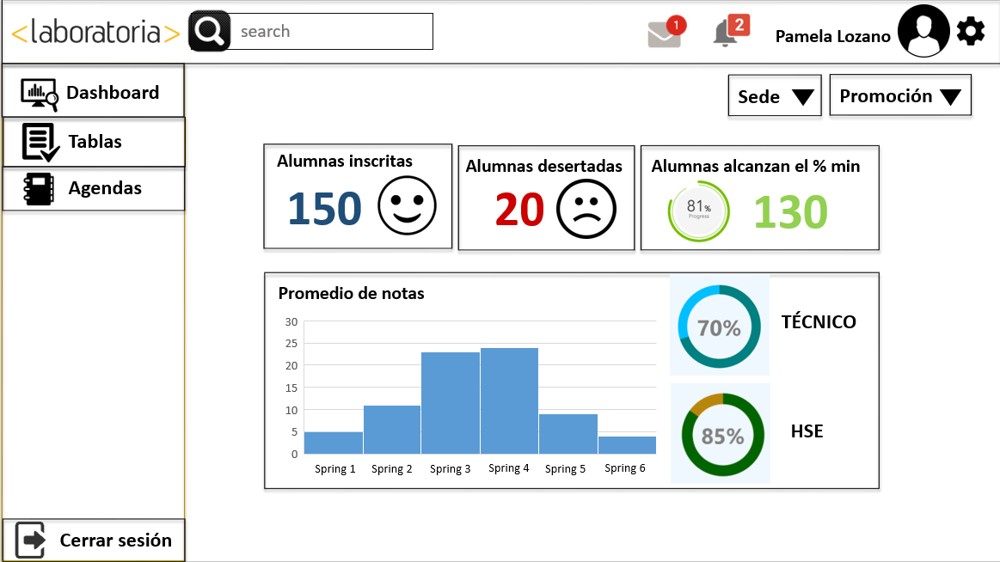

# Creación del dashboard de Laboratoria

## Descripción del Proyecto:

El proyecto consiste en la elaboración del sketch del dashboard de Laboratoria. Una herramienta utilizada por profesores, training managers, directores y gerentes de Laboratoria para ver rápidamente qué está pasando en el salón de clases.

## Objetivo
En este repositorio se visualizara un sketch sincillo, siguiendo las recomendaciones: 

* Número de alumnas inscritas.
* Número de alumnas que desertaron.
* Número y % de alumnas que pasan el criterio mínimo de evaluación.
* Promedio de notas por sprint.
* Promedio de notas HSE.
* Promedio de notas técnicas Además, dado que Laboratoria tiene muchas generaciones, regularmente 2 generaciones por año (estas generaciones empezaron en el 2014), y que opera en 4 sedes (Arequipa, Ciudad de México, Lima y Santiago de Chile), es posible que los usuarios quieran ver datos de sedes / generaciones anteriores para poder hacer comparaciones.

## Dashboard Laboratoria

